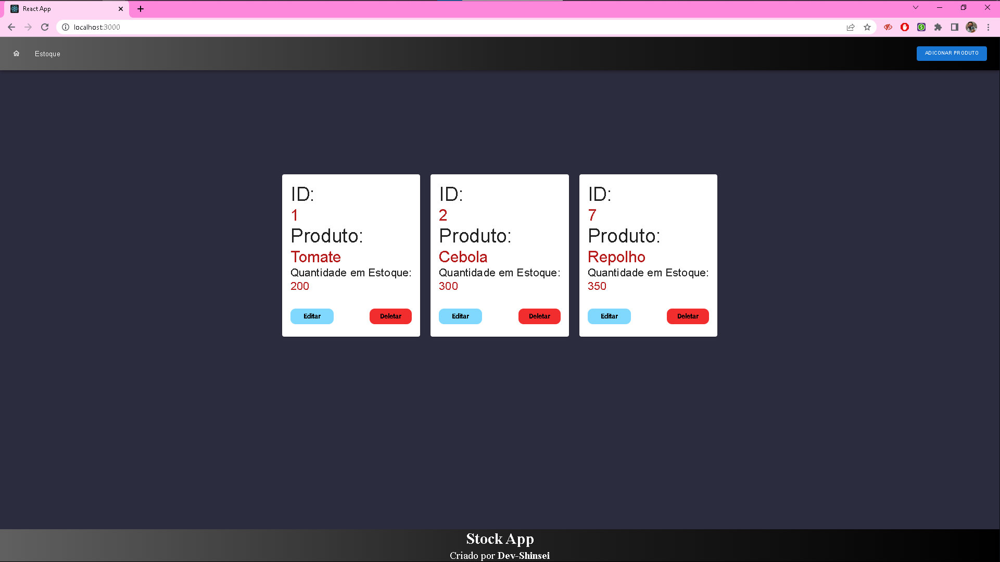

<h1 align="center">stockApp</h1>

## :page_with_curl: Sobre

stockApp, aplicação CRUD para controle de estoque.
Esse projeto foi desenvolvido como desafio em um processo de seleção para uma vaga de estágio.

- ReactJS - Tecnologia utilizada para desenvolvimento do front.
- Node - Utilizado para desenvolvimento do back.
- MaterialUI - Biblioteca usada para agilizar a construção da interface da aplicação.
- SQLite - Banco de dados compacto, util para aplicações com baixo fluxo de dados.

# Imagem da aplicação:

<h1 align="center">
  
</h1>

## :hammer: Tecnologias

Este projeto foi desenvolvido com as seguintes tecnologias:

- [NodeJS](https://nodejs.org/en/)
- [ExpressJS](https://expressjs.com/pt-br/)
- [React](https://pt-br.reactjs.org)
- [MaterialUI](https://v4.mui.com/pt/)
- [SASS](https://sass-lang.com/)
- [SQLite](https://www.sqlite.org/index.html)
- [VS Code](https://code.visualstudio.com/)

## :books: Requisitos

- Ter [**Git**](https://git-scm.com/) para clonar o projeto.
- Ter [**Node.js**](https://nodejs.org/en/) instalado.

## :gear: Iniciando App

```bash
  # Iniciar a aplicação:
  $ npm start
  $ cd client
  $ npm start
```

Feito por Carlos Gomes 👋🏻 [Me visita <3!](https://github.com/Dev-Shinsei)
